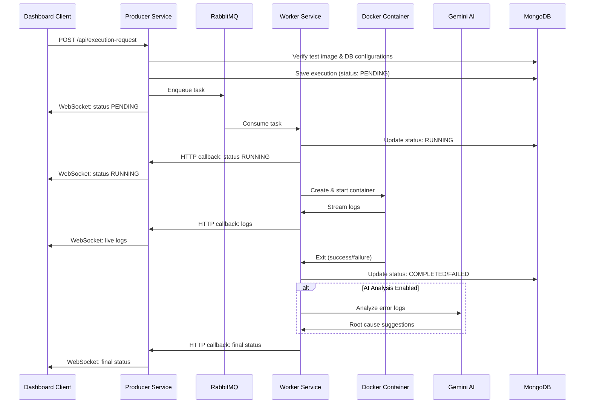
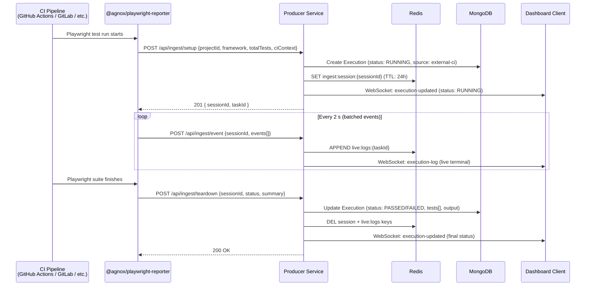
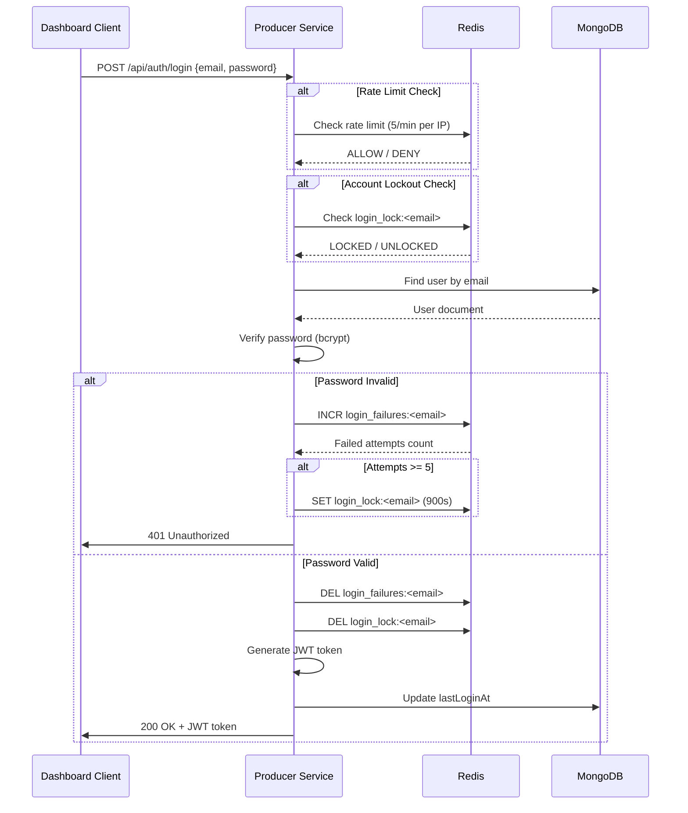
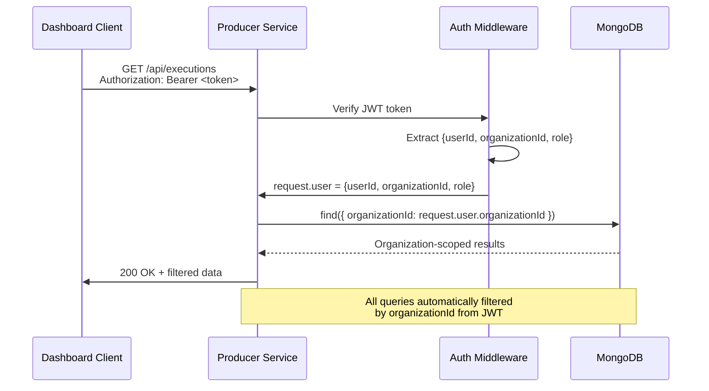

> Agnox enables universal test execution and instant AI debugging for modern engineering teams.

## Overview
Agnox is a unified platform designed to seamlessly integrate with your CI/CD pipelines, execute tests across any framework, and provide actionable, AI-powered root cause analysis directly in your pull requests.

---

## System Architecture

Agnox is a microservices-based test automation platform designed for multi-tenant SaaS deployment.

```mermaid
graph TB
    subgraph "Client Layer"
        UI[Dashboard Client<br/>React + Vite]
    end

    subgraph "Active Runner Path — Agnox Hosted"
        RabbitMQ[RabbitMQ<br/>Task Distribution]
        Worker[Worker Service<br/>Docker Orchestration]
        Docker[Docker Engine<br/>Test Containers]
    end

    subgraph "Passive Reporter Path — External CI"
        Reporter["@agnox/playwright-reporter<br/>External CI<br/>(GitHub Actions / GitLab / Jenkins)"]
    end

    subgraph "API Layer"
        Producer[Producer Service<br/>Fastify + TypeScript]
        Socket[Socket.io<br/>Real-time Updates]
    end

    subgraph "Data Layer"
        Mongo[(MongoDB<br/>Multi-tenant Data)]
        Redis[(Redis<br/>Cache + Queues)]
    end

    subgraph "External Services"
        Gemini[AI Providers (BYOK)<br/>Gemini / GPT-4o / Claude]
        Email[Email Service<br/>SMTP/SendGrid]
        Slack[Notifications & Webhooks<br/>Slack / MS Teams / Generic]
    end

    UI -->|HTTPS/WSS| Producer
    UI <-->|WebSocket| Socket
    Producer --> Mongo
    Producer --> Redis
    Producer --> RabbitMQ
    Producer --> Email

    RabbitMQ --> Worker
    Worker --> Docker
    Worker --> Mongo
    Worker --> Redis
    Worker --> Gemini

    Reporter -->|"POST /api/ingest/setup|event|teardown"| Producer

    Socket -.->|Organization Rooms| UI
```

> **Dual Architecture:** Agnox supports two integration modes. **Agnox Hosted** provisions Docker containers and executes tests via the RabbitMQ → Worker pipeline. **External CI** allows `@agnox/playwright-reporter` to stream results from any existing CI environment directly to the Ingest API — no Docker image or infrastructure changes required.

---

## Component Responsibilities

### Dashboard Client (`apps/dashboard-client/`)
**Technology:** React 19 + TypeScript + Vite + Tailwind CSS

**Responsibilities:**
- User interface for test execution, monitoring, and management
- Real-time test logs and status updates via Socket.io
- Organization and user management settings
- Team member invitations and role management

**Key Features:**
- Mobile-responsive design powered strictly by Tailwind CSS
- Real-time WebSocket connection with JWT authentication
- Auth context for global authentication state
- **Global Project Selector:** `ProjectContext.tsx` provides a platform-wide `activeProjectId` (persisted in `localStorage`); a project dropdown in `DashboardHeader.tsx` synchronises context, URL `?project=` param, and all data-fetching hooks simultaneously.
- **Contextual Sliding Sidebar:** When navigating to `/settings`, the persistent sidebar animates to reveal a dedicated settings sub-menu. The full settings sections are: **Profile**, **Organization**, **Team Members**, **Billing & Plans**, **AI Models**, **Usage**, **Run Settings**, **Env Variables**, **Connectors**, **Schedules**, and **Features**. Admin-only tabs (Billing & Plans, Features) are hidden for non-admin roles.

**Port:** 8080 (exposed via Docker Compose)

---

### Producer Service (`apps/producer-service/`)
**Technology:** Fastify + TypeScript + MongoDB + Redis + RabbitMQ

**Responsibilities:**
- RESTful API server for all client requests
- Authentication and authorization (JWT-based)
- Multi-tenant data isolation (organizationId filtering)
- Task queuing via RabbitMQ
- WebSocket server for real-time updates
- Static file serving (HTML test reports)

**Key Features:**
- HS256 JWT authentication with Redis-backed revocation blacklist
- Role-Based Access Control (Admin, Developer, Viewer)
- Redis-based rate limiting (per-organization + per-IP)
- Security headers (HSTS preload, CSP, X-Frame-Options)
- Login attempt tracking with account lockout
- CORS production configuration
- Email service integration (invitations)

**Port:** 3000 (internal)

**Routes:**
- `/api/auth/*` - Authentication (signup, login, logout)
- `/api/users/*` - User management (admin only)
- `/api/organization/*` - Organization settings (including `slackWebhookUrl` and `slackNotificationEvents`)
- `/api/invitations/*` - Team member invitations (admin only)
- `/api/executions/*` - Test execution history, bulk ops, artifact listing
- `/api/execution-request` - Queue new test execution
- `/api/schedules/*` - CRON schedule management (create, list, delete)
- `/api/test-cases/*` - Manual test case CRUD, AI step generation, bulk/suite delete
- `/api/test-cycles/*` - Hybrid test cycle management, item updates, cycle deletion
- `/api/projects/:projectId/env` - Per-project environment variable CRUD (secrets encrypted at rest)
- `/api/ci/trigger` - Native CI/CD pipeline trigger; accepts `x-api-key` or Bearer JWT; creates test cycle + execution and queues to RabbitMQ
- `/api/ingest/setup` - Reporter session setup (100 req/min per API key)
- `/api/ingest/event` - Stream batched test events from external reporters (500 req/min per API key)
- `/api/ingest/teardown` - Finalize reporter session and persist execution record
- `/api/metrics/:image` - Performance insights
- `/reports/*` - Static HTML test reports
- `/api/organization/ai-config` - GET/PATCH AI model config and BYOK keys (admin only for PATCH)
- `/api/ai/generate-bug-report` - Feature A: Auto-generate structured bug report from execution logs
- `/api/ai/analyze-stability` - Feature B: Flakiness analysis for a test group (persists to `stability_reports`)
- `/api/ai/stability-reports` - Feature B: History of stability reports for org
- `/api/ai/optimize-test-cases` - Feature C: Dual-agent BDD optimization for up to 20 test cases
- `/api/webhooks/ci/pr` - Feature D: Smart PR routing webhook (maps changed files → test folder)
- `/api/ai/chat` - Feature E: Two-turn quality chatbot (NL → MongoDB pipeline → answer + optional chart)
- `/api/ai/chat/history` - Feature E: List chat sessions for org
- `/api/ai/chat/:conversationId` - Feature E: Full message history for a conversation
- `/api/integrations/linear` - GET/PUT Linear integration credentials (AES-256-GCM encrypted API key + teamId)
- `/api/linear/issues` - POST: create a Linear issue from an execution; writes back to `execution.linearIssues[]`
- `/api/integrations/monday` - GET/PUT Monday.com integration (encrypted token + boardId + optional groupId)
- `/api/monday/items` - POST: create a Monday.com board item from an execution; writes back to `execution.mondayItems[]`
- `/api/integrations/:provider` - DELETE: unlink an integration (admin-only; `$unset`s encrypted credentials)
- `/api/ai/spec-to-tests` - Feature F: SSE streaming endpoint (multipart upload, 4-stage pipeline)
- `/api/test-cases/bulk` - DELETE: bulk delete up to 100 test cases
- `/api/test-cases/suite` - DELETE: delete all test cases in a suite
- `/api/test-cycles/:id` - DELETE: hard-delete a cycle (409 if RUNNING)

---

### Playwright Reporter (`packages/playwright-reporter/`)
**Package:** `@agnox/playwright-reporter` — published as an npm package for external Playwright users.

**Responsibilities:**
- Implement Playwright's `Reporter` interface to intercept test lifecycle events
- Stream live test results to the Agnox Ingest API (`/api/ingest/*`) without requiring Docker
- Auto-detect CI platform environment variables and attach CI context to each run

**Key Files:**
- `src/index.ts` - `AgnoxReporter` class (Playwright `Reporter` implementation)
- `src/client.ts` - `AgnoxClient` — typed HTTP client for the Ingest API
- `src/batcher.ts` - `EventBatcher` — buffers events and flushes every 2 s (configurable)
- `src/types.ts` - `AgnoxReporterConfig`, `IngestEvent`, `ICiContext` interfaces

**Design Principles:**
- "Do No Harm" — all errors are caught silently; reporter failures never affect the test suite
- Zero peer dependencies beyond `@playwright/test`
- Runs produced by this reporter appear as `source: 'external-ci'` in the Dashboard

---

### Worker Service (`apps/worker-service/`)
**Technology:** Node.js + TypeScript + Docker SDK

**Responsibilities:**
- Consume tasks from RabbitMQ queue
- Background Docker image pre-fetching to minimize execution wait times
- Orchestrate Docker containers for test execution
- Stream live test logs to Producer Service
- Collect test results and reports
- Optional AI-powered root cause analysis (Gemini API)

**Key Features:**
- Dynamic Docker container creation (custom images supported)
- Live log streaming via HTTP callbacks to Producer
- AI analysis with organization-level opt-out
- Test report extraction (HTML, JSON, XML)
- Performance metrics tracking (Redis)

**Key Files:**
- `worker.ts` - Main consumer and orchestrator
- `analysisService.ts` - Multi-provider dual-agent AI pipeline (Analyzer → Critic); resolves LLM via BYOK org config or platform fallback

---

### Dual-Agent (Actor-Critic) AI Architecture

The Worker's root cause analysis feature — as well as the Producer's Test Optimizer (`POST /api/ai/optimize-test-cases`) — use a **two-pass Actor-Critic pipeline** implemented directly in `analysisService.ts` and the AI routes. This pattern prevents LLM hallucinations by having a second, deterministic model validate every claim before it reaches the end user.

```
Input: raw logs (up to 60,000 chars)
          │
          ▼
┌─────────────────────────────────────────────────────────┐
│  STEP 1 — Analyzer (Actor)                              │
│  Model:       resolved via resolveLlmConfig()           │
│               (BYOK org key → platform fallback)        │
│  Temperature: 0.4  (creative, generates suggestions)    │
│  Schema:      responseSchema enforced JSON output       │
│               { rootCause: string, suggestedFix: string }│
│  System:      "Expert QA Automation Investigator"       │
└─────────────────────┬───────────────────────────────────┘
                      │ structured JSON
                      ▼
┌─────────────────────────────────────────────────────────┐
│  STEP 2 — Critic (Evaluator)                            │
│  Model:       same as Analyzer (same resolved config)   │
│  Temperature: 0.0  (deterministic, no creativity)        │
│  Input:       raw logs + Analyzer JSON output            │
│  Task:        validate every claim; override             │
│               hallucinated or unsupported suggestions    │
│  Output:      final developer-facing Markdown           │
│               (### 🚨 Root Cause / ### 🛠️ Suggested Fix) │
└─────────────────────────────────────────────────────────┘
```

**Design decisions:**
- The Analyzer uses `responseMimeType: "application/json"` and a `responseSchema` to guarantee structured output — the Critic receives clean data, not free-form text.
- The Critic runs at temperature 0.0 to be fully deterministic. Its system instruction explicitly prohibits mentioning any "review process" or "draft" — the output reads as a single authoritative answer.
- Log slicing: `logs.slice(-60000)` is applied before both passes so both models see exactly the same evidence window.
- If the Analyzer fails to produce valid JSON, a safe fallback object is created and passed to the Critic, which still produces a useful (if generic) output.

---

### MongoDB
**Purpose:** Primary data store for multi-tenant data

**Collections:**
- `organizations` - Organization details, plans, limits, billing (Stripe sub-document), AI preferences, `slackWebhookUrl`
- `users` - User accounts, roles, authentication data
- `invitations` - Team member invitations (pending/accepted/expired)
- `executions` - Test execution history and results
- `projects` - Project definitions per organization (name, Docker image, test folder)
- `projectRunSettings` - Per-project environment URLs (Dev, Staging, Production)
- `apiKeys` - Hashed API keys for CI/CD integration
- `audit_logs` - Admin action audit trail
- `webhook_logs` - Stripe webhook event log
- `schedules` - CRON schedule definitions: expression, environment, image, folder, baseUrl
- `test_cases` - Manual and automated test case definitions: steps array, suite grouping, AI-generated content, `stabilityScore`, `isQuarantined`, `aiFlag` field for spec-to-test
- `test_cycles` - Hybrid test cycles: items array with status tracking, summary stats, cycle-level status, `projectId` field
- `projectEnvVars` - Per-project environment variables; `isSecret=true` values stored as AES-256-GCM encrypted payloads
- `stability_reports` - Flakiness analysis results per group: score (0-100), verdict, findings, recommendations, passRate. Tenant-isolated.
- `chat_sessions` - Multi-turn AI chat conversations: messages array, conversationId (UUID), 24h TTL. Tenant-isolated.
- `ingest_sessions` - Temporary session records for `@agnox/playwright-reporter` teardown (TTL collection).

**Storage Tracking:**
- **Mechanism A:** Worker atomically `$inc`s `limits.currentStorageUsedBytes` on every execution finish.
- **Mechanism B:** `jobs/storage-reconciler.ts` nightly cron (02:00 UTC) recalculates true byte usage via MongoDB `$bsonSize` aggregation and corrects any drift.

**Indexes:**
- `organizationId` - All collections (multi-tenant filtering)
- `email` - Users (unique, login lookup)
- `tokenHash` - Invitations (unique, validation)
- `slug` - Organizations (unique, URL-friendly)
- `stripeCustomerId` - Organizations (Stripe integration lookup)

**Port:** 27017

---

### Redis
**Purpose:** Caching, rate limiting, login tracking, performance metrics

**Use Cases:**
- Rate limiting counters (per-organization, per-IP)
- Login attempt tracking (brute force prevention)
- Account lockout state (15-minute duration)
- Performance metrics (test duration history)
- Active token revocation blacklist (JWT)

**Port:** 6379

---

### RabbitMQ
**Purpose:** Task queue for test execution distribution, with fair multi-tenant scheduling

**Queue:** `test_queue` — declared with `{ durable: true, arguments: { 'x-max-priority': 10 } }`

**Fair Scheduling (v3.5.0):**
Every message is assigned a numeric priority (1–10) before being enqueued. The priority is computed by `computeOrgPriority()` in `apps/producer-service/src/utils/scheduling.ts`:

```
priority = max(1, 10 - runningCount × 2)
```

Where `runningCount` is the number of RUNNING executions for that organization. An idle organization receives priority 10 (highest); an organization already running 5 concurrent jobs receives priority 1 (lowest). The RabbitMQ broker delivers higher-priority messages first, preventing large organizations from starving smaller ones during peak load.

> **Migration note:** If upgrading from a version without `x-max-priority`, the existing `test_queue` must be deleted from the RabbitMQ Management UI before the first deploy, as queue arguments cannot be changed on an existing queue.

**Message Format:**
```json
{
  "taskId": "unique-id",
  "organizationId": "org-id",
  "image": "docker-image:tag",
  "command": "npm test",
  "tests": ["test1", "test2"],
  "config": {
    "baseUrl": "...",
    "envVars": { "BASE_URL": "...", "E2E_EMAIL": "..." },
    "secretKeys": ["E2E_EMAIL", "E2E_PASSWORD"]
  },
  "cycleId": "optional-cycle-id",
  "cycleItemId": "optional-cycle-item-id"
}
```

> `secretKeys` lists the keys in `envVars` whose values are secrets. The worker uses this to redact values from streamed logs via `sanitizeLogLine()`. Secrets are decrypted server-side before entering the queue and never stored in plaintext in MongoDB.

**Port:** 5672 (AMQP), 15672 (Management UI)

---

## Data Flow

### Test Execution Flow



---

### External CI Ingest Flow (Passive Reporter)



> Results appear in the Dashboard under the **External CI** source filter. The reporter never blocks or crashes the CI pipeline — all errors are caught silently.

---

### Authentication Flow



---

### Multi-Tenant Data Isolation



---

## Security Architecture

### Multi-Layer Security

1. **Network Layer**
   - HTTPS/TLS in production
   - CORS origin validation (environment-based)
   - Security headers (HSTS, X-Frame-Options, CSP)

2. **Application Layer**
   - JWT authentication (HS256, 24h expiration)
   - Password hashing (bcrypt, 10 rounds)
   - Role-Based Access Control (RBAC)
   - Redis-based rate limiting (per-org + per-IP)
   - Login attempt tracking (5 attempts, 15-minute lockout)

3. **Data Layer**
   - Multi-tenant data isolation (organizationId filtering)
   - MongoDB user authentication
   - Encrypted connections (TLS)

4. **API Layer**
   - Input validation on all endpoints
   - Parameterized queries (MongoDB, no SQL injection)
   - Authorization checks before data access
   - 404 responses to prevent information leakage

### Authentication & Authorization

**Roles:**
- **Admin:** Full access (invite users, change roles, modify organization)
- **Developer:** Execute tests, view results, manage own profile
- **Viewer:** Read-only access to test results

**JWT Claims:**
```json
{
  "userId": "507f1f77bcf86cd799439011",
  "organizationId": "507f191e810c19729de860ea",
  "role": "admin",
  "iat": 1706947200,
  "exp": 1707033600
}
```

---

## Scalability Considerations

### Horizontal Scaling

**Producer Service:**
- Stateless design (all state in MongoDB/Redis)
- Can run multiple instances behind load balancer
- Socket.io with Redis adapter for multi-instance support (future)

**Worker Service:**
- Horizontally scalable (multiple workers consume from same queue)
- RabbitMQ distributes tasks across workers
- Each worker manages its own Docker containers

### Performance Optimizations

**Caching:**
- Redis for rate limit counters (fast in-memory lookups)
- MongoDB indexes on frequently queried fields
- Static file serving with caching headers

**Database:**
- Compound indexes on `{organizationId, status, startTime}`
- Pagination for large result sets
- Connection pooling (MongoDB driver default)

---

## Deployment Architecture

### Development (Docker Compose)

```yaml
services:
  dashboard-client:      # React app (port 8080)
  producer-service:      # API server (port 3000)
  worker-service:        # Task processor
  mongodb:               # Database (port 27017)
  redis:                 # Cache (port 6379)
  rabbitmq:              # Message queue (port 5672, 15672)
```

### Production Considerations

- **Reverse Proxy:** Nginx/Traefik for HTTPS termination
- **Database:** MongoDB replica set for high availability
- **Redis:** Redis Sentinel for failover
- **RabbitMQ:** Clustered setup for reliability
- **Monitoring:** Prometheus + Grafana for metrics
- **Logging:** Centralized logging (ELK stack or similar)
- **Backups:** Automated MongoDB backups to S3/cloud storage

---

## Technology Stack Summary

| Component | Technology | Purpose |
|-----------|-----------|---------|
| **Frontend** | React 19 + TypeScript + Vite | User interface |
| **Styling** | Tailwind CSS | Mobile-responsive design |
| **Backend API** | Fastify + TypeScript | RESTful API server |
| **Real-time** | Socket.io | WebSocket connections |
| **Database** | MongoDB | Multi-tenant data storage |
| **Cache** | Redis | Rate limiting, sessions |
| **Queue** | RabbitMQ | Task distribution |
| **Container** | Docker SDK | Test execution isolation |
| **AI** | Google Gemini / OpenAI / Anthropic | Multi-provider LLM: root cause analysis, bug gen, test optimization, chatbot. BYOK supported via `resolveLlmConfig()` |
| **Email** | SendGrid (`@sendgrid/mail`) | Invitation emails, transactional notifications |
| **Auth** | JWT (jsonwebtoken) | HS256 stateless authentication + Redis Blacklist |
| **Password** | bcrypt | Secure password hashing |

---

## Design Principles

1. **Multi-Tenancy First:** All features designed with organization isolation
2. **Security by Default:** Authentication, authorization, rate limiting built-in
3. **Framework Agnostic:** Support any Docker image and test framework
4. **Real-time Experience:** WebSocket updates for live test monitoring
5. **Scalable Architecture:** Stateless services, message queue, caching
6. **Developer Experience:** Clear APIs, comprehensive documentation
7. **Privacy Controls:** Organization-level AI opt-out capability

---

## Related Documentation

- [API Documentation](../api-reference/api-overview.md)
- [Deployment Guide](./deployment.md)
- [Security Audit](./security-audit.md)

---

## v3.5.0 Reliability & Operations Improvements

### Fair Scheduling

See the [RabbitMQ section](#rabbitmq) above for the priority queue implementation. The key design principle is that **queue priority is dynamically recalculated per-message** based on real-time RUNNING execution counts — there are no static quotas or reserved slots. This means:

- Small organizations are always preferred over busy large organizations.
- Organizations that have finished all their runs immediately return to priority 10 for the next submission.
- The system is self-correcting: no operator intervention is needed to rebalance load.

### Hardened Playwright Timeouts (Fail-Fast)

The system test runner (`tests/`) enforces strict timeouts to protect worker capacity:

| Setting | Value | Rationale |
|---------|-------|-----------|
| `retries` | `0` | No automatic retries. Every flaky or slow test fails immediately and surfaces in the report. |
| Global test timeout | `15 000 ms` | A test that does not complete within 15 seconds is aborted, the container exits, and the worker is freed for the next job. |

These settings ensure that a single stuck test cannot hold a worker container indefinitely, which is critical in a shared multi-tenant environment.

### Monitoring Endpoint

`GET /api/system/monitor-status` provides a machine-readable signal for external uptime monitors (UptimeRobot, BetterStack, etc.) that powers [status.agnox.dev](https://status.agnox.dev).

**Authentication:** The endpoint requires a valid `X-Agnox-Monitor-Secret` header. This header value must match the `MONITORING_SECRET_KEY` environment variable configured on the server. Requests with a missing or incorrect value receive `401 Unauthorized`. This prevents public enumeration of internal service health details.

```bash
# Example health probe
curl -s \
  -H "X-Agnox-Monitor-Secret: <your-monitor-secret>" \
  https://api.agnox.dev/api/system/monitor-status
```

**Example Response:**
```json
{
  "success": true,
  "data": {
    "status": "healthy",
    "version": "3.5.0",
    "timestamp": "2026-02-27T10:00:00.000Z"
  }
}
```

**Infrastructure note:** Add `MONITORING_SECRET_KEY` to your `.env` and to the GitHub Actions deployment secrets. The monitoring service (UptimeRobot / BetterStack) should be configured with the same secret value as a custom HTTP header in its check configuration.

### Automated Test Image Lifecycle

The CI/CD pipeline now automatically builds and publishes `keinar101/agnox-tests:latest` as a multi-platform Docker image (`linux/amd64` + `linux/arm64`) on every push to `main`. See [Deployment Guide — Automated Test Image Lifecycle](./deployment.md#automated-test-image-lifecycle-v350) for full details.

---

## Known Limitations

### Google Chrome on ARM64 Servers

Agnox currently runs on a Linux ARM64 server (Oracle Cloud).
Google Chrome and Microsoft Edge do **not** support Linux ARM64.

**Impact:** Test projects that use `--browser-channel chrome` or
`--browser-channel msedge` in their `pytest.ini` or Playwright config
will fail with:

```
BrowserType.launch: Chromium distribution 'chrome' is not found
```

**Workaround:** Remove `--browser-channel chrome` from your pytest/Playwright
config and use `--browser chromium` instead. Chromium is fully supported
on ARM64 and produces identical results for most web applications.

**Roadmap:** Full Chrome/Edge support on x86 infrastructure is planned.
See roadmap below.
